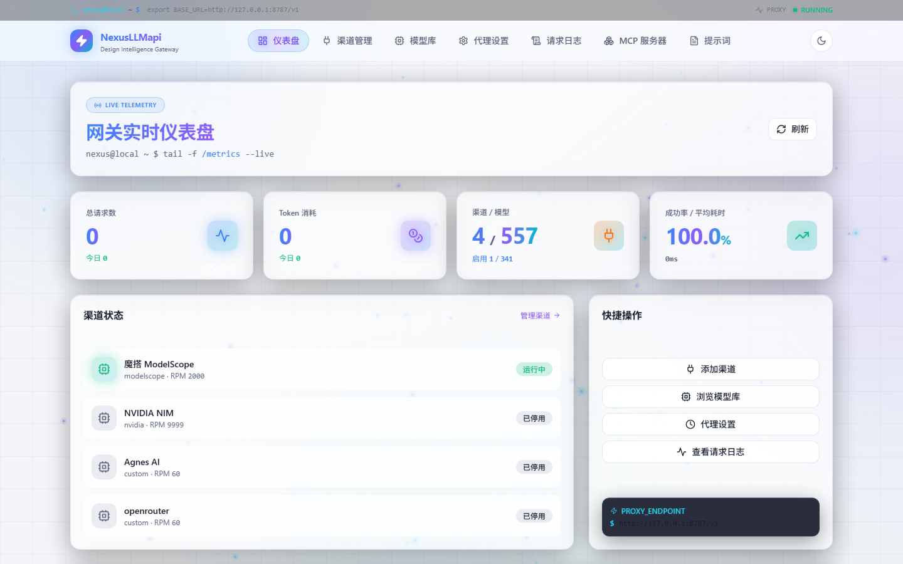
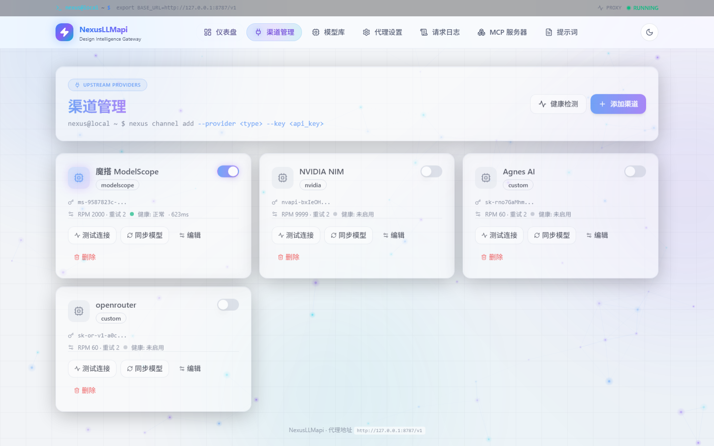
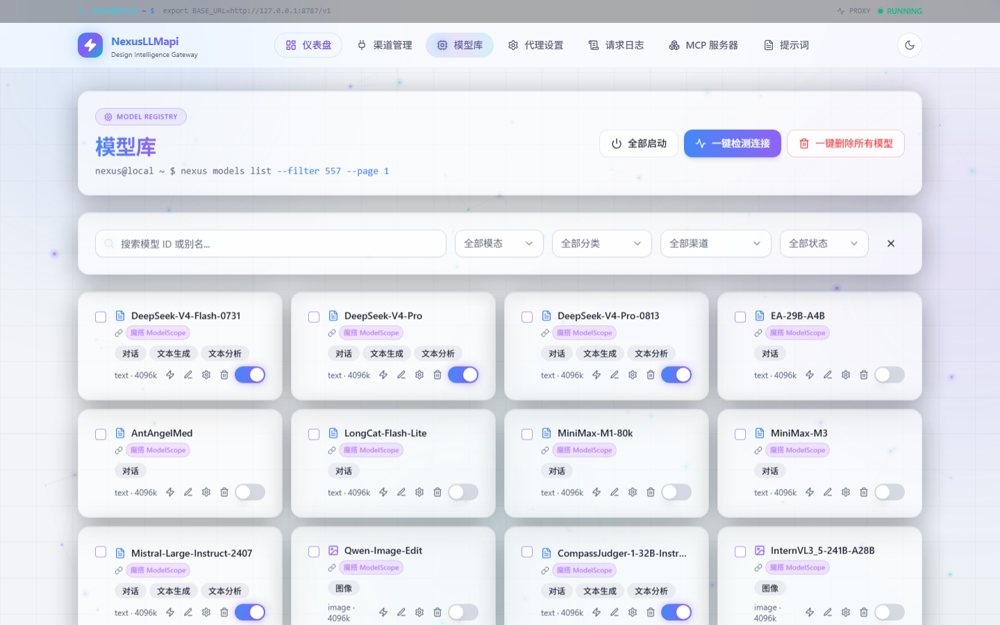
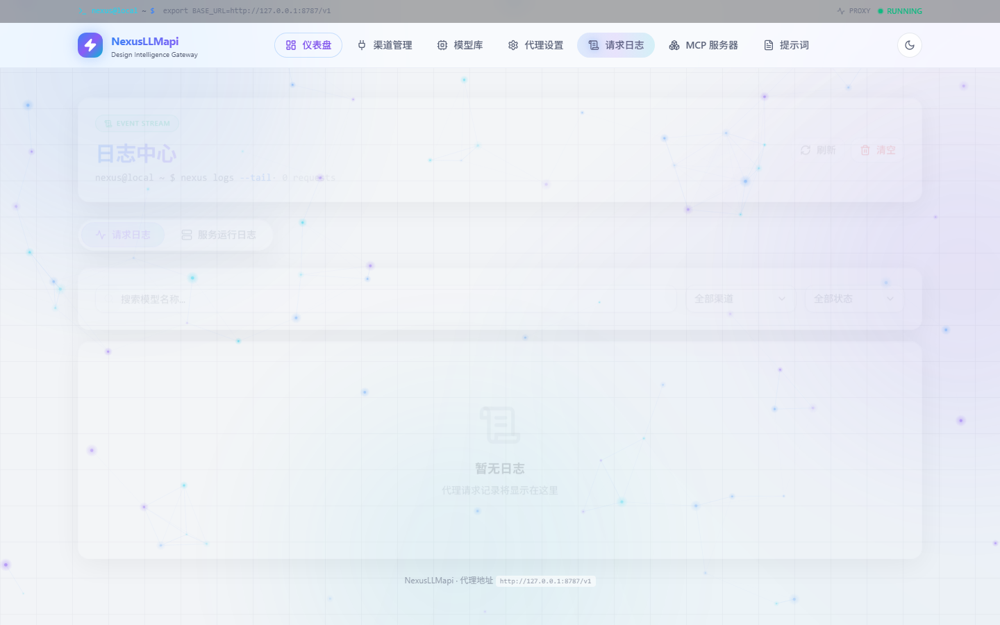
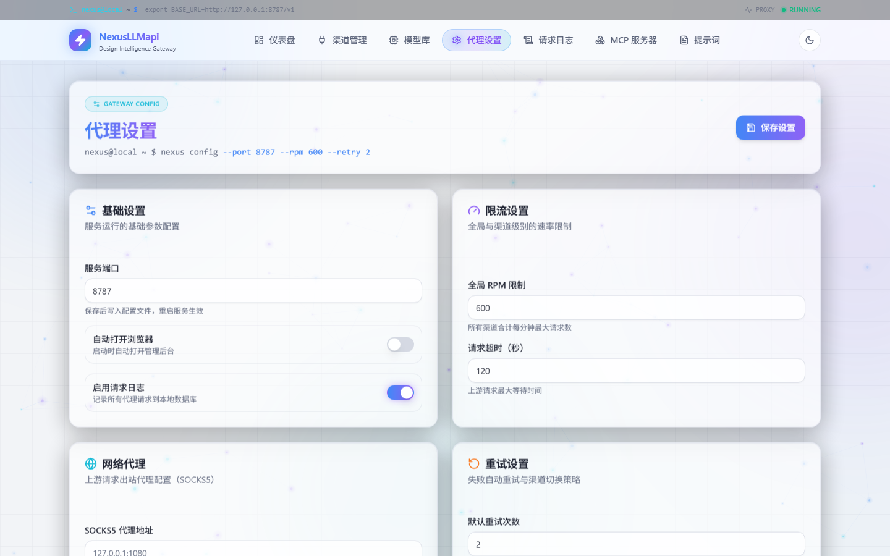
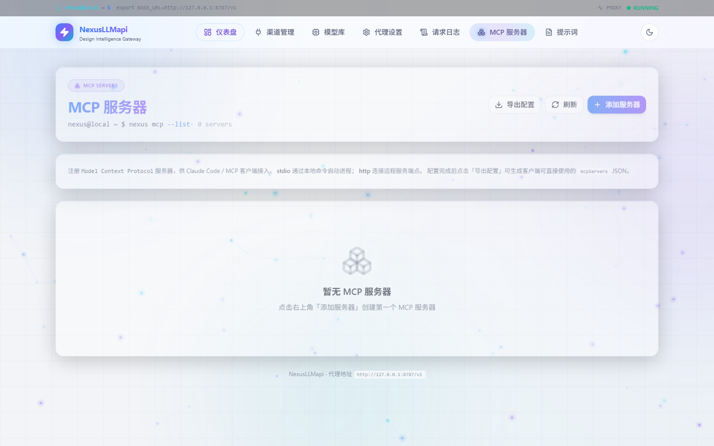
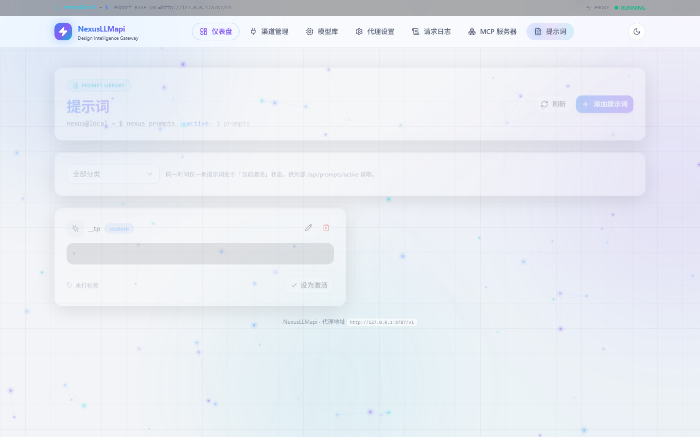
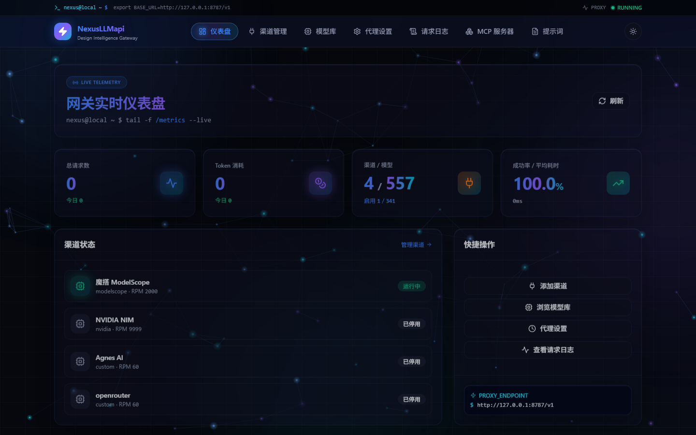
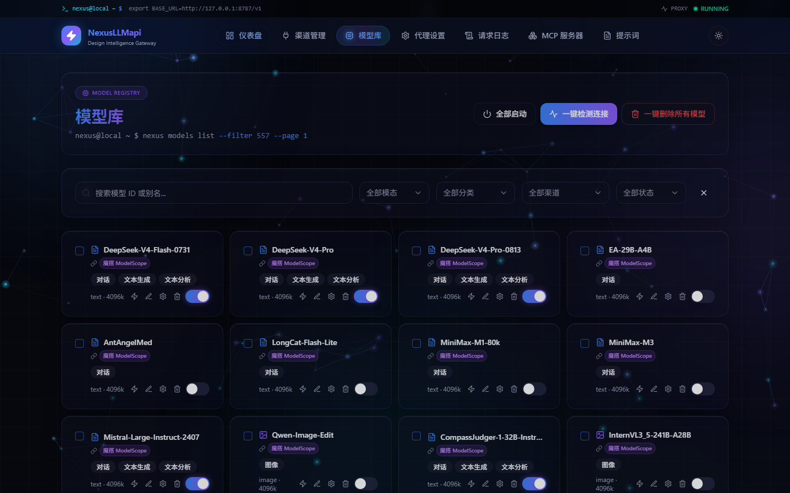

# NexusLLMapi

**Design Intelligence Gateway** —— 本地 AI 模型中转网关

聚合多供应商渠道，对外暴露统一的 **OpenAI / Anthropic / Responses** 三种协议，内置 **Supervisor + Worker 进程自愈**，并附带完整的 Web 管理面板。开箱即用，`npm start` 一条命令启动。

> 仅监听 `127.0.0.1`，本地 API 不加鉴权，适合个人 / 家庭环境集中管理多个模型渠道（API Key、限流、重试、熔断、日志都在本地）。

---

## 界面预览

> 以下为管理面板实际运行截图（默认明亮模式，右上角可一键切换暗夜模式）。

| 实时仪表盘 | 渠道管理 |
|---|---|
|  |  |

| 模型库 | 请求日志 |
|---|---|
|  |  |

| 代理设置 | MCP 服务器 |
|---|---|
|  |  |

| 提示词 |
|---|
|  |

### 暗夜模式

右上角主题切换按钮可一键切换到暗夜模式（深色光感 + 粒子背景）。

| 实时仪表盘（暗夜） | 模型库（暗夜） |
|---|---|
|  |  |

---

## 特性

**协议与接入**

- 统一对外暴露 **OpenAI（`/v1/chat/completions`）**、**Anthropic（`/v1/messages`）**、**Responses（`/v1/responses`）** 三种协议，内部自动做协议转换
- 兼容 `Embeddings`、`/v1/models` 模型列表
- 支持 `GET/POST /p/:channel_id/*` 按指定渠道透传
- 原生 SSE 流式输出，支持 Claude Code / 各类工具调用完整往返（`tool_use` / `tool_result` / `input_json_delta` / 多轮连续工具循环）
- 图片 / 视频生成端点（OpenAI 兼容，`/v1/images/generations`、`/v1/video/generations`）

**路由与稳定性**

- **多供应商智能路由**：精确模型 → 别名 → 模型梯队 → 降级切换；连续失败自动熔断冷却
- **粘性会话**：同一客户端 30 分钟固定同一渠道，渠道失效自动重路由
- **渠道级重试**：`retry_count`（-1 继承全局 / 0 不重试 / 1–10 覆盖全局）优先于 `default_retry`；尊重上游 `Retry-After`；401/403/404 不重试，429/5xx 按规则重试
- **渠道健康检查**：后台定时 + 手动触发，仅将真实上游故障计入熔断统计（用户取消、限流、并发满、Supervisor 停机不计入）
- **Supervisor 自愈**：Worker 崩溃自动重启、心跳超时 / HTTP 探活失败强制重启、crash-loop 保护退避、慢启动宽限、优雅退出释放端口

**资源管理**

- 客户端断开即 **Abort 上游真实 HTTP 请求**（非仅释放本地槽位）
- 流式空闲超时（`idle_timeout_ms`），上游卡住自动中断并补发 error SSE
- SSE 背压处理：上游高速写入时暂停读取，`drain` 后恢复，防止无限内存增长；不保存完整流式响应体，日志仅记录 token/耗时/状态摘要
- `/health/deep` 实时暴露 `active_requests` / `active_streams`

**管理面板**

- 页面：仪表盘、渠道管理、模型库、代理设置、请求日志、**MCP 服务器**、**提示词**
- 模型库：**13 种分类**、**8 种模态**（文本/图像/视频/嵌入/重排/语音识别/语音合成）筛选，跨页「全部启动」/「一键检测连接」/「批量启停删除」，模型连接速度检测，客户端配置一键复制
- 首次启动且无渠道时自动弹出**聚焦点击新手向导**（跨页面高亮引导完成添加渠道 / 同步模型 / 接入客户端）
- 前端风格：深色光感 + 粒子背景 + 毛玻璃 + 鼠标点击特效，多页面响应式

**运维**

- 请求统计、Token 用量、渠道状态、日志检索（日志自动脱敏，不保存流式响应体）
- SOCKS5 代理支持
- SQLite WAL 一致性备份（官方 backup API），最多保留 5 份，备份后 `quick_check`
- 仅监听 `127.0.0.1`，本地 API 不加鉴权

---

## 架构

```
┌────────────────────────────────────────────────────────────┐
│                       Supervisor (main.ts)                  │
│   fork Worker → 心跳/HTTP 探活 → 超时强制重启 → 孤儿回收     │
└──────────────────────────────┬─────────────────────────────┘
                               │ IPC (heartbeat / shutdown)
                               ▼
┌────────────────────────────────────────────────────────────┐
│                  Worker (worker.ts) 127.0.0.1:8787         │
│  ┌──────────────┐  ┌──────────────┐  ┌──────────────────┐  │
│  │  Fastify API │  │  Gateway     │  │  Model Pool      │  │
│  │  /v1 /api    │  │  路由/重试    │  │  梯队/熔断/粘性   │  │
│  │  /health     │  │  协议转换    │  │                  │  │
│  └──────────────┘  └──────────────┘  └──────────────────┘  │
│  ┌──────────────┐  ┌──────────────┐  ┌──────────────────┐  │
│  │  Transport   │  │  Health      │  │  SQLite (WAL)    │  │
│  │  Abort/背压   │  │  渠道检查/自检│  │  渠道/模型/日志  │  │
│  └──────────────┘  └──────────────┘  └──────────────────┘  │
└────────────────────────────────────────────────────────────┘
```

- **单进程自愈，无外部依赖**：不依赖 PM2 / NSSM / Windows Service / 心跳脚本，Worker 真卡死（不响应心跳、不响应 IPC、不响应 SIGTERM）时 Supervisor 按「IPC → SIGTERM → SIGKILL」逐级强制回收并拉起新 Worker
- **前端**：Vue 3 + Vite 构建产物由 Worker 同端口托管，SPA 路由回退到 `index.html`

---

## 快速开始

### 前置要求

| 依赖 | 版本 |
|---|---|
| Node.js | **≥ 22**（推荐 22 / 24） |
| npm | ≥ 10 |

> `better-sqlite3@13` 采用 N-API 预编译二进制，随 npm 包内置，**无需本机 C++ 编译工具链**。

### 安装与启动

```bash
git clone https://github.com/CreativeMarian/NexusLLMapi.git
cd NexusLLMapi
npm ci
npm start
```

启动完成后：

- 管理面板：**http://127.0.0.1:8787**
- API 端点：**http://127.0.0.1:8787/v1**

> `npm start` 的 `prestart` 钩子（`scripts/ensure-build.cjs`）会自动编译缺失 / 过期的 `dist-server` 与 `web/dist`，无需手动先执行 build。
>
> 首次启动会自动生成 `data/config.json`（内置默认值）与空的 `data/store.db`（SQLite），**不需要手动创建任何配置文件**。

### 开发模式

```bash
npm run dev
```

API（8787，tsx watch 热重载）+ Vite 前端（5173，HMR）并行启动。

---

## 使用

### 第一步：添加渠道

> **新手引导**：首次启动且尚未配置任何渠道时，打开管理面板会自动弹出分步向导。点击「开始引导」即可跟着聚焦高亮逐步完成配置（跨「渠道管理 / 模型库」页面）；也可随时「跳过」，按下述手动步骤操作。

打开管理面板 → **渠道管理** → 添加渠道，填写：

- 名称（如 `openai-main`）
- Provider（`openai` / `ollama` / `gemini` / `azure` / `openrouter` / `modelscope` / `nvidia` / `custom` 等）
- Base URL
- API Key

保存后点击「同步模型」，模型会自动拉取并进入「模型库」。

### 第二步：接入客户端

| 参数 | 值 |
|---|---|
| Base URL | `http://127.0.0.1:8787/v1` |
| API Key | `sk-nexus`（任意非空字符串） |
| 模型 ID | 从前端「模型库」复制 |

**OpenAI SDK 示例**

```python
from openai import OpenAI

client = OpenAI(
    base_url="http://127.0.0.1:8787/v1",
    api_key="sk-nexus",
)
resp = client.chat.completions.create(
    model="gpt-4o",
    messages=[{"role": "user", "content": "Hello"}],
    stream=True,
)
for chunk in resp:
    print(chunk.choices[0].delta.content, end="")
```

**curl 示例**

```bash
curl http://127.0.0.1:8787/v1/chat/completions \
  -H "Content-Type: application/json" \
  -H "Authorization: Bearer sk-nexus" \
  -d '{"model": "gpt-4o", "messages": [{"role": "user", "content": "Hello"}]}'
```

**Anthropic SDK / Claude Code**

```bash
export ANTHROPIC_BASE_URL=http://127.0.0.1:8787
export ANTHROPIC_AUTH_TOKEN=sk-nexus
claude
```

**Responses API（含 tools）**

```bash
curl http://127.0.0.1:8787/v1/responses \
  -H "Content-Type: application/json" \
  -H "Authorization: Bearer sk-nexus" \
  -d '{"model": "gpt-4o", "input": "What is 2+2?", "tools": [{"type": "function", "name": "calc", "description": "计算", "parameters": {"type": "object", "properties": {}}}]}'
```

**图片 / 视频生成**

```bash
curl http://127.0.0.1:8787/v1/images/generations \
  -H "Content-Type: application/json" \
  -H "Authorization: Bearer sk-nexus" \
  -d '{"model": "图像模型ID", "prompt": "a cat"}'
```

---

## API 参考

| 方法 | 路径 | 说明 |
|---|---|---|
| POST | `/v1/chat/completions` | OpenAI 兼容对话 / 流式 |
| POST | `/v1/messages` | Anthropic 协议（自动转换，含工具调用） |
| POST | `/v1/responses` | OpenAI Responses 协议（含 tools / function_call / stream） |
| POST | `/v1/images/generations` | 图片生成（OpenAI 兼容，需启用图像模型） |
| POST | `/v1/video/generations` | 视频生成（需启用视频模型） |
| POST | `/v1/embeddings` | 向量生成 |
| GET | `/v1/models` | 可用模型列表 |
| GET/POST | `/p/:channelId/*` | 按渠道透传（channelId 支持 id 或名称） |
| GET | `/health/live` | 存活探针 |
| GET | `/health/ready` | 就绪探针 |
| GET | `/health/deep` | 深度自检（active_requests / active_streams 等） |
| GET/POST | `/api/channels` 等 | 管理 API（面板后端，含同步/测试/健康检查） |
| GET/POST | `/api/mcp`、`/api/prompts` | MCP 服务器与提示词管理 |

---

## 配置

配置保存在 `data/config.json`，**首次启动自动生成**（含以下默认值）。除 `port` 外均可通过前端「代理设置」页或 `PUT /api/settings` 热更新。

| 字段 | 默认值 | 说明 |
|---|---|---|
| `port` | `8787` | 服务端口（修改后重启生效） |
| `global_rpm` | `600` | 全局令牌桶速率（次/分钟） |
| `default_retry` | `2` | 全局默认重试次数（渠道级 `retry_count` 优先） |
| `default_cooldown` | `1` | 熔断冷却秒数 |
| `request_timeout` | `120` | 上游请求超时（秒） |
| `max_channel_conns` | `100` | 单渠道并发上限 |
| `socks5_proxy` | 空 | SOCKS5 代理地址 |
| `channel_health_interval_sec` | `300` | 渠道健康检查周期（秒） |
| `idle_timeout_ms` | `300000` | 流式空闲超时（毫秒，`0`=关闭） |
| `auto_open_browser` | `false` | 启动后自动打开浏览器 |

`data/` 目录（数据库、日志、配置）被 `.gitignore` 忽略，本地修改不会污染仓库。

---

## 项目结构

```
NexusLLMapi/
├── server/                 # 后端（TypeScript）
│   ├── main.ts             # Supervisor 入口（fork 自身为 Worker）
│   ├── worker.ts           # Worker：初始化模块、监听端口、心跳 IPC
│   ├── supervisor/         # 自愈监控（心跳/探活/重启/crash-loop 保护）
│   ├── gateway/            # 网关（模型路由池、协议转换、重试、流式、背压）
│   ├── providers/          # 供应商适配、模型分类打标与 HTTP Transport
│   ├── health/             # 活跃请求注册、渠道健康检查、自检
│   ├── routes/             # Fastify 路由（网关 / 管理 / 健康）
│   ├── config/             # 配置管理（data/config.json，内置默认值）
│   └── db/                 # SQLite 访问层（better-sqlite3，WAL）
├── web/                    # 前端（Vue 3 + Vite + Tailwind）
│   └── src/
│       ├── views/          # 仪表盘/渠道/模型库/设置/日志/MCP/提示词
│       └── components/     # UI 组件（毛玻璃卡片、粒子背景、新手向导等）
├── tests/                  # Vitest 测试套件
├── scripts/                # ensure-build / 打包等脚本
├── docs/screenshots/       # 界面预览截图
├── data/                   # 运行时数据（不入库）
├── package.json
└── README.md
```

---

## 测试

```bash
npm test          # Vitest 全量测试（137 用例，12 个测试文件）
npm run typecheck # TypeScript 全量类型检查
```

覆盖范围：数据库兼容与 SQLite WAL 备份一致性、Provider 头构造、路由与 SPA 回退、重试三态语义（-1/0/1–10 与状态码规则）、SSE 流式与背压、客户端断开真实 Abort 上游、Supervisor 自愈（正常退出 / 真卡死强杀 / 慢启动 / 孤儿回收）、ensure-build 增量构建、Anthropic / Responses 工具调用往返、资源释放路径（无 listener / timer / AbortSignal 泄漏）等。

---

## 常用命令

| 命令 | 说明 |
|---|---|
| `npm start` | 生产启动（自动构建 + Supervisor + Worker，监听 8787） |
| `npm run dev` | 开发模式（API 8787 + Vite 5173） |
| `npm run build` | 构建前端 `web/dist` + 后端 `dist-server` |
| `npm run typecheck` | TypeScript 全量类型检查 |
| `npm test` | 运行测试套件 |

---

## 技术栈

- **后端**：Node.js ≥ 22 + TypeScript + Fastify 4 + better-sqlite3 13（N-API，WAL 模式）
- **前端**：Vue 3 + Pinia + Vite 5 + Tailwind CSS + shadcn-vue 风格组件
- **测试**：Vitest 2

---

## 许可

本项目仅供个人本地使用与学习参考。请自行确认使用方式符合各上游 API 提供商的服务条款。
